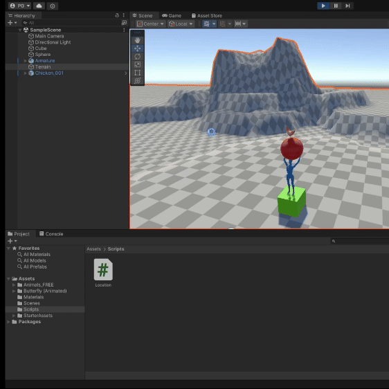

# p01-introduccion-unity
---------------------------------
# Ejemplo de funcionamiento


# Descripción del proyecto.
- Como se puede apreciar en el ejemplo, se han añadido un cubo, una esfera y un terreno al proyecto. También se han añadido un starter asset: la figura humana del paquete Third Person Starter Assets.
- También se ha añadido una gallina de [otro asset de la asset store](https://assetstore.unity.com/packages/3d/characters/animals/animals-free-low-poly-asset-pack-by-ithappy-260727)
- Se han modificado los colores de los elementos.
- En el GIF se muestra el script que muestra la posición de los objetos, con su correspondiente nombre y tag.
- El siguiente código corresponde al script:
```c#
using System.Collections;
using System.Collections.Generic;
using UnityEngine;
public class Location : MonoBehaviour
{
    // Start is called before the first frame update
    void Start()
    {
        Transform objectTransform = gameObject.GetComponent<Transform>();
        Debug.Log(gameObject.name + " con tag " + gameObject.tag + ": x= " + objectTransform.localPosition.x + " y= " + objectTransform.localPosition.y + " z= " + objectTransform.localPosition.z);
    }
    // Update is called once per frame
    void Update()
    {   
    }
}
```
- `gameObject` hace referencia al objeto que está llamando al script. De esta manera, el script se incorpora como componente de cada objeto que se quiere mostrar y tenemos un script genérico que no implica especificar los tags de cada uno de los objetos. Una alternativa para esto podría ser crear un objeto vacío que tenga asociado un script en que se especifiquen todos los tags de los objetos que se quieran imprimir por pantalla y buscarlos por su id con `GameObject.FindByTag()`.
